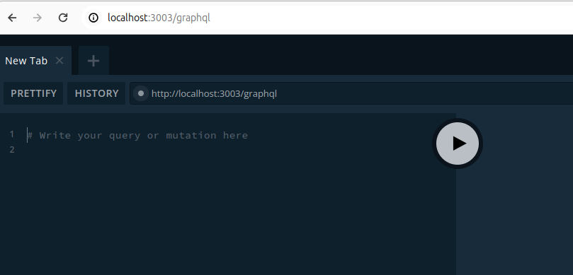

# HealthcareHub

## Description

HealthcareHub is a platform where healthcare professionals can consult with each other, share knowledge, and discuss cases. The platform includes features such as user authentication, case discussions, real-time chat, and user profiles, built using Nest.js, GraphQL, and PostgreSQL.

## Table of Contents

- [Installation](#installation)
- [Usage](#usage)
- [Features](#features)
- [Seeding the Database](#seeding-the-database)
- [License](#license)

## Installation

### Prerequisites

- [Node.js](https://nodejs.org/en/) (version 14.x or later)
- [npm](https://www.npmjs.com/get-npm) (version 6.x or later)
- [PostgreSQL](https://www.postgresql.org/download/)

### Steps

1. **Clone the repository:**

   ```bash
   git clone https://github.com/yourusername/healthcarehub.git
   cd healthcarehub
   ```

2. **Install dependencies:**

   ```bash
   npm install
   ```

3. **Set up environment variables:**

   Create a `.env` file in the root directory and add your PostgreSQL configuration:

   ```env
   DATABASE_HOST=localhost
   DATABASE_PORT=5432
   DATABASE_USERNAME=yourusername
   DATABASE_PASSWORD=yourpassword
   DATABASE_NAME=healthcarehub
   JWT_SECRET=yourjwtsecret
   ```

4. **Run the application:**

   ```bash
   npm run start:dev
   ```

## Usage

Once the application is running, you can access the GraphQL Playground at `http://localhost:3000/graphql` to interact with the API.


## Features

- **User Authentication:** Secure user login and registration using JWT.
- **Case Discussions:** Healthcare professionals can create, view, and discuss cases.
- **Real-Time Chat:** Real-time communication using GraphQL subscriptions.
- **User Profiles:** Manage and view user profiles.

## Seeding the Database

To seed the database with fake data:

1. **Install the `faker` library:**

   ```bash
   npm install @faker-js/faker
   ```

2. **Create the seeder script (`seeder.ts`):**

   ```typescript
   import { NestFactory } from '@nestjs/core';
   import { AppModule } from './app.module';
   import { UserService } from './user/user.service';
   import { CaseService } from './case/case.service';
   import { CreateUserDto } from './user/create-user.dto';
   import { CreateCaseDto } from './case/create-case.dto';
   import { faker } from '@faker-js/faker';

   async function bootstrap() {
     const app = await NestFactory.createApplicationContext(AppModule);
     const userService = app.get(UserService);
     const caseService = app.get(CaseService);

     // Seed users
     for (let i = 0; i < 10; i++) {
       const userDto: CreateUserDto = {
         name: faker.name.findName(),
         email: faker.internet.email(),
       };
       await userService.create(userDto);
     }

     const users = await userService.findAll();

     // Seed cases
     for (let i = 0; i < 20; i++) {
       const caseDto: CreateCaseDto = {
         title: faker.lorem.sentence(),
         description: faker.lorem.paragraph(),
         userId: users[Math.floor(Math.random() * users.length)].id,
       };
       await caseService.create(caseDto);
     }

     await app.close();
   }

   bootstrap();
   ```

3. **Run the seeder script:**

   ```bash
   ts-node seeder.ts
   ```

This script will populate the database with 10 users and 20 cases using the `faker` library for generating random data.

